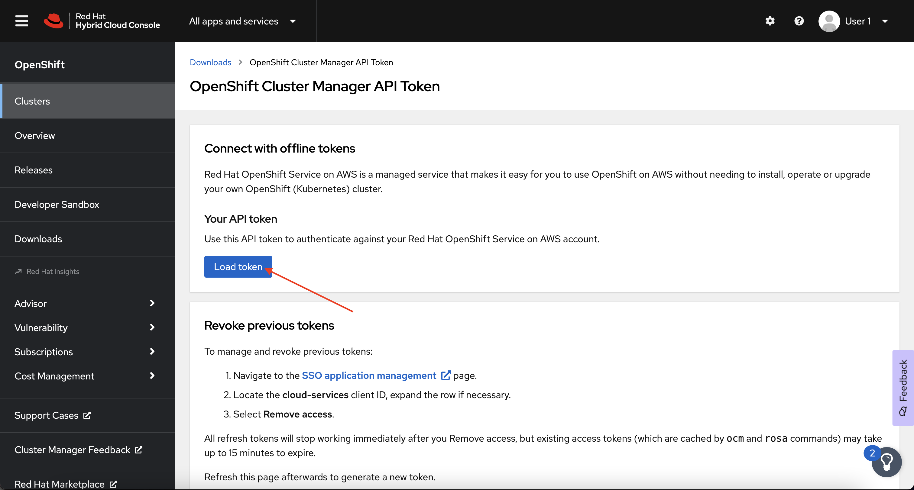

# Create an ROSA Cluster

During this workshop, you will be working on a cluster that you will create yourself in this step. This cluster will be dedicated to you. 

The first step we need to do is assign an environment variable to this user ID. All the AWS resources that you will be creating will be tagged with your user ID to ensure that only you can modify it.

While logged in to the cloud bastion host that you should still have open from the "Environment Setup" section, run the following command to ensure the system has the correct environment variables for your user (if not, request help from the workshop team):

```bash
env | grep -E  'WS_'
```

### Login to the ROSA CLI

Before we can create a ROSA cluster, we need to login to the ROSA CLI using a token from the OpenShift Cluster Manager.

1. First, [click here](https://console.redhat.com/openshift/token/rosa){:target="_blank"} and login to the OpenShift Cluster Manager using the provided workshop credentials.

1. Next, click the *Load Token* button to generate a new login token. 

    { align=center }

1. Next, copy the newly generated *Authentication Command*, **not the token itself**. 

    { align=center }

1. Finally, paste the newly generated command into your open terminal to login to the ROSA CLI.

    ```bash
    rosa login --token="abcdefghijklmnopqrstuvwxyzABCDEFGHIJKLMNOPQRSTUVWXYZ....."
    ```

    If everything has worked as expected, you should see output that looks like this:
    ```
    I: Logged in as 'user#_mobbws' on 'https://api.openshift.com'
    ```

!!! note

    Normally, you would need to also authenticate against the AWS CLI in addition to logging in to the ROSA CLI. Luckily, we've already done that for you in this workshop environment!


### Create User Role

Before we can begin creating our cluster, we need to create a user role. The ROSA user role is an AWS role used by Red Hat to verify the customer’s AWS identity. This role has no additional permissions, and the role has a trust relationship with the Red Hat installer account. To create the role, run the following command:

```bash
rosa create user-role --mode auto --yes
```

### Create Your ROSA Cluster

!!! note

    Normally, you would need to create additional STS roles before you could install the cluster. These roles are explained in more detail [here](https://docs.openshift.com/rosa/rosa_architecture/rosa-sts-about-iam-resources.html){:target="_blank"}.

1. Create your cluster by running the following commands: 

    !!! note

        This will take between 30 and 60 minutes.

    ```bash
    rosa create cluster \
    --sts \
    --cluster-name ${WS_USER/_/-} \
    --role-arn arn:aws:iam::395050934327:role/ManagedOpenShift-Installer-Role \
    --support-role-arn arn:aws:iam::395050934327:role/ManagedOpenShift-Support-Role \
    --controlplane-iam-role arn:aws:iam::395050934327:role/ManagedOpenShift-ControlPlane-Role \
    --worker-iam-role arn:aws:iam::395050934327:role/ManagedOpenShift-Worker-Role \
    --operator-roles-prefix ${WS_USER/_/-}-${WS_UNIQUE} \
    --tags created-by:${WS_USER} \
    --multi-az \
    --region ${AWS_DEFAULT_REGION} \
    --version 4.11.17 \
    --replicas 3 \
    --compute-machine-type m5.xlarge \
    --machine-cidr 10.0.0.0/16 \
    --service-cidr 172.30.0.0/16 \
    --pod-cidr 10.128.0.0/14 \
    --host-prefix 23 \
    --mode auto \
    --yes
    ```

    !!! note

        In this case, we've already given you a command to run to ensure you get a cluster with exactly the settings necessary for the workshop. The table at the bottom of this page explains what each of these options do, but you can also provide all of these settings by running `rosa create cluster` and following the interactive prompts!

1. (Optional) Watch the cluster as it runs through the installation process. 

    ```bash
    rosa logs install -c ${WS_USER/_/-} --watch
    ```

    You will see a significant amount of output, eventually ending with something similar to:
    ```
    I: Cluster 'user1-mobbws' has been successfully installed
    ```


### Installation Options Explained

| Option     | Description |
| ----------- | ------------------------------------ |
| `--sts`       | Use [AWS Secure Token Service](https://docs.aws.amazon.com/STS/latest/APIReference/welcome.html){:target="_blank"} to generate temporary, limited-privilege credentials for the cluster to use.  | 
| `--cluster-name`       | The name of the cluster, in our case, we're using your username, but replacing the `_` with a `-` as underscores aren't allowed!                 | 
| `--role-arn`, ` --support-role-arn`, ` --controlplane-iam-role`, `--worker-iam-role`    | These are account-level STS roles that we are using for the cluster and management service. | 
| `--operator-roles-prefix`       | A prefix for other STS roles that operators in the cluster will use. |
| `--tags` | A created-by tag for us to use to keep track of clusters and ensure isolation from other workshop participants. |
| `--region` | The region the cluster will be deployed into. |
| `--version` | The version of OpenShift we will be deploying. |
| `--replicas` | The number of worker node instances to deploy during cluster install. |
| `--compute-machine-type` | The AWS instance type to use for worker nodes. |
| `--machine-cidr`, `--service-cidr`, `--pod-cidr`, `--host-prefix` | The various network ranges to use for the cluster. |
| `--mode`, `--yes` | Setting this to `mode=auto` and using `--yes` automatically create the necessary operator STS roles, along with the cluster's OIDC STS provider. |
