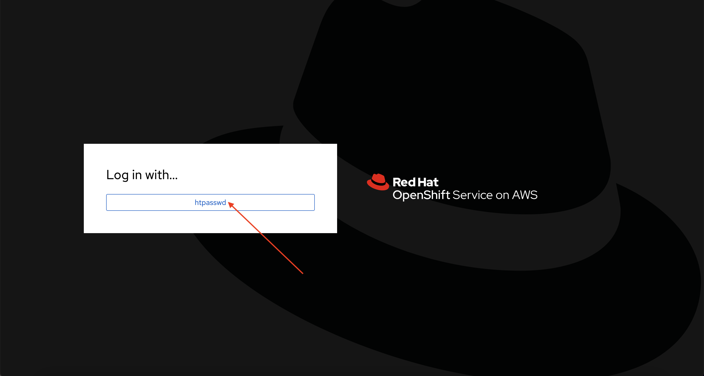
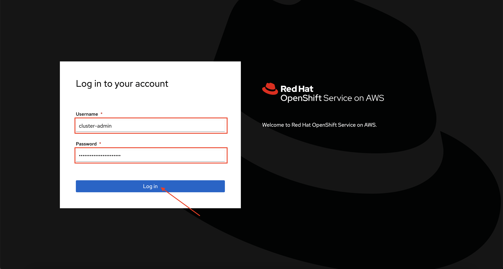

## Access the OpenShift Console and CLI

### Create a cluster-admin user

Before we can access the cluster, we need to create a cluster-admin user for us to use to authenticate. This will allow us to login without configuring an external identity provider. To do so, run the following command:

```bash
rosa create admin --cluster "${WS_USER/_/-}"
```

Your output should look something similar to this:

```{.text .no-copy}
I: Admin account has been added to cluster 'user1-mobbws'.
I: Please securely store this generated password. If you lose this password you can delete and recreate the cluster admin user.
I: To login, run the following command:

   oc login https://api.user1-mobbws.33bq.p1.openshiftapps.com:6443 --username cluster-admin --password ABCDE-FGHIJ-00000-00000

I: It may take several minutes for this access to become active.
```

Ensure that you capture that username and password before moving on to next steps and store it somewhere safe.

!!! warning

    It may take a few minutes for your newly added cluster-admin account to show you up.

### Login to the OpenShift CLI

To login to the OpenShift CLI, simply run the printed command from the previous section once you've waited for a few minutes.

!!! info "Your command would look like the following, but with your cluster name and password"

```{.text .no-copy}
oc login https://api.user1-mobbws.33bq.p1.openshiftapps.com:6443 \
  --username cluster-admin --password ABCDE-FGHIJ-00000-00000
```

Your output should look similar to:

```{.text .no-copy}
Login successful.

You have access to 100 projects, the list has been suppressed. You can list all projects with 'oc projects'

Using project "default".
Welcome! See 'oc help' to get started.
```

!!! warning
        If you receive an error that looks like the below output, wait a few more minutes and try again:

        ```{.text .no-copy}
        Login failed (401 Unauthorized)
        Verify you have provided the correct credentials.
        ```

### Login to the OpenShift Web Console

Next, let's log in to the OpenShift Web Console. To do so, follow the below steps:

1. First, we'll need to grab your cluster's web console URL. To do so, run the following command:

    ```bash
    oc whoami --show-console
    ```

    Your output will look similar to:

    ```{.text .no-copy}
    https://console-openshift-console.apps.user1.33bq.p1.openshiftapps.com
    ```

1. Next, open the printed URL in a web browser.

1. Click on the `htpasswd` identity provider.

    { align=center }

1. Enter the username and password from the above previous section.

    { align=center }

    If you don't see an error, congratulations! You're now logged into the cluster and ready to move on to the workshop content.
