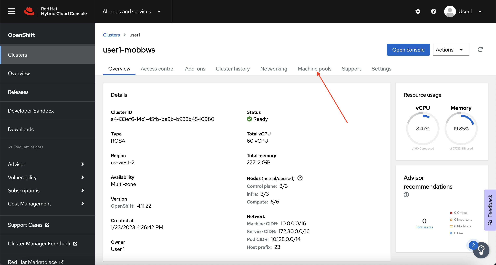
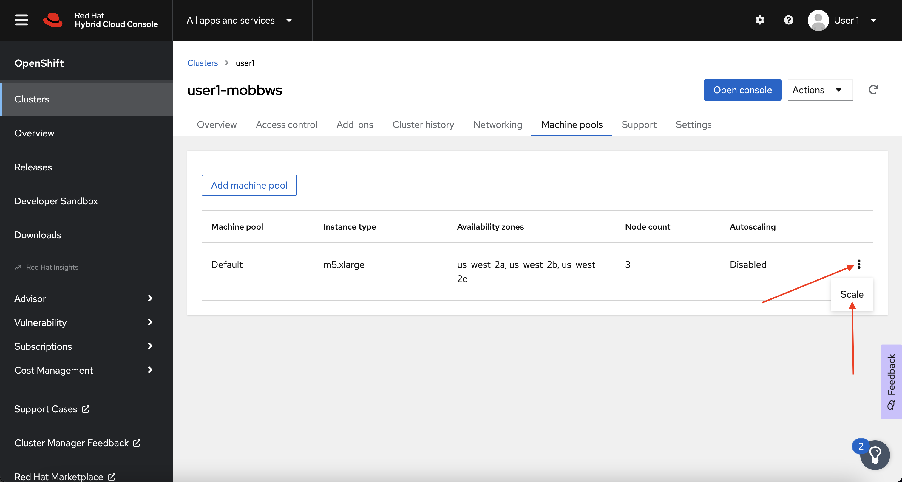
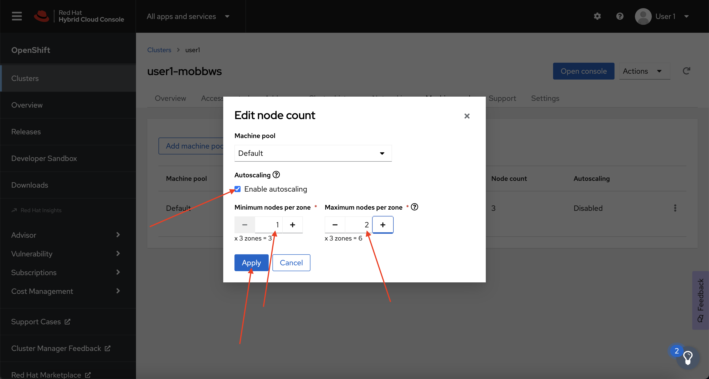

## Introduction

The cluster autoscaler adjusts the size of an ROSA cluster to meet the resource needs of the cluster. The cluster autoscaler increases the size of the cluster when there are pods that fail to schedule on any of the current worker nodes due to insufficient resources or when another node is necessary to meet deployment needs. The cluster autoscaler does not increase the cluster resources beyond the limits that you specify. To learn more about cluster autoscaling, visit the [Red Hat documentation for cluster autoscaling](https://docs.openshift.com/rosa/rosa_cluster_admin/rosa_nodes/rosa-nodes-about-autoscaling-nodes.html){:target="_blank"}.

## Enable Autoscaling on the Default MachinePool

!!! note

    It is important to note, that even though we are enabling autoscaling via the OpenShift Cluster Manager, this can also be done via the ROSA CLI. 

1. Log back into the OpenShift Cluster Manager by [clicking here](https://console.redhat.com/openshift). If you need to reauthenticate, use the credentials provided by the workshop team. 

1. In the Cluster section, locate your cluster and click on it. 

    { align=center }

1. Next, click on the *Machine pools* tab. 

    { align=center }

1. Next, click on the ⋮ icon beside the *Default* machine pool, and select *Scale*. 

    { align=center }

1. Finally, check the *Enable autoscaling* checkbox, and set the minimum to `1` and maximum to `2`, then click *Apply*. 

    { align=center }

1. Next, let's check to see that our managed machine autoscalers have been created. To do so, run the following command:

    ```bash
    oc -n openshift-machine-api get machineautoscaler
    ```

    You should see output similar to:

    ```{.text .no-copy}
    NAME                                   REF KIND     REF NAME                        MIN   MAX   AGE
    user1-mobbws-6sj5f-worker-{{ aws_region }}a   MachineSet   user1-mobbws-6sj5f-worker-{{ aws_region }}a   1     2     18s
    user1-mobbws-6sj5f-worker-{{ aws_region }}b   MachineSet   user1-mobbws-6sj5f-worker-{{ aws_region }}b   1     2     18s
    user1-mobbws-6sj5f-worker-{{ aws_region }}c   MachineSet   user1-mobbws-6sj5f-worker-{{ aws_region }}c   1     2     18s
    ```

1. And finally, let's check to see that our cluster autoscaler has been created. To do so, run the following command:

    ```bash
    oc -n openshift-machine-api get clusterautoscaler
    ```

    You should see output similar to:

    ```{.text .no-copy}
    NAME      AGE
    default   3m
    ```

## Test the Cluster Autoscaler

Now let's test the cluster autoscaler and see it in action. To do so, we'll deploy a job with a load that this cluster cannot handle. This should force the cluster to scale to handle the load.

1. First, let's create a namespace (also known as a project in OpenShift). To do so, run the following command:

    ```bash
    oc new-project autoscale-ex
    ```

1. Next, let's deploy our job that will exhaust the cluster's resources and cause it to scale more worker nodes. To do so, run the following command:

    ```yaml
    cat << EOF | oc apply -f -
    apiVersion: batch/v1
    kind: Job
    metadata:
      generateName: maxscale
      namespace: autoscale-ex
    spec:
      template:
        spec:
          containers:
          - name: work
            image: busybox
            command: ["sleep",  "300"]
            resources:
              requests:
                memory: 500Mi
                cpu: 500m
            securityContext:
              allowPrivilegeEscalation: false
              capabilities:
                drop:
                  - ALL
          restartPolicy: Never
      backoffLimit: 4
      completions: 50
      parallelism: 50
    EOF
    ```

1. After a few seconds, run the following to see what pods have been created.

    ```bash
    oc -n autoscale-ex get pods
    ```

    Your output will look something like this:

    ```{.text .no-copy}
    NAME                     READY   STATUS    RESTARTS   AGE
    maxscale-2bdjf   0/1     Pending   0          2s
    maxscale-2tvd6   0/1     Pending   0          2s
    maxscale-48rt7   0/1     Pending   0          2s
    maxscale-4nmch   0/1     Pending   0          2s
    maxscale-4zpnf   0/1     Pending   0          2s
    [...]
    ```

    Notice that we see a lot of pods in a pending state.  This should trigger the cluster autoscaler to create more machines using the MachineAutoscaler we created.


1. Let's check to see if our MachineSet automatically scaled. To do so, run the following command:

    ```bash
    oc -n openshift-machine-api get machinesets
    ```

    You should see output similar to:

    ```{.text .no-copy}
    NAME                                   DESIRED   CURRENT   READY   AVAILABLE   AGE
    user1-mobbws-6sj5f-infra-{{ aws_region }}a    1         1         1       1           20h
    user1-mobbws-6sj5f-infra-{{ aws_region }}b    1         1         1       1           20h
    user1-mobbws-6sj5f-infra-{{ aws_region }}c    1         1         1       1           20h
    user1-mobbws-6sj5f-worker-{{ aws_region }}a   2         2         1       1           20h
    user1-mobbws-6sj5f-worker-{{ aws_region }}b   2         2         1       1           20h
    user1-mobbws-6sj5f-worker-{{ aws_region }}c   2         2         1       1           20h
    ```

    This shows that the cluster autoscaler is working on scaling multiple MachineSets up to 2.

1. Now let's watch the cluster autoscaler create and delete machines as necessary. To do so, run the following command:

    ```bash
    watch oc -n openshift-machine-api get machines \
    -l machine.openshift.io/cluster-api-machine-role=worker
    ```

    Your output will look like this:

    ```{.text .no-copy}
    Every 2.0s: ip-10-0-3-193.{{ aws_region }}.compute.internal: Tue Jan 24 21:32:18 2023

    NAME                                         PHASE         TYPE        REGION      ZONE         AGE
    user1-mobbws-6sj5f-worker-{{ aws_region }}a-frzrq   Provisioned   m5.xlarge   {{ aws_region }}   {{ aws_region }}a   2m54s
    user1-mobbws-6sj5f-worker-{{ aws_region }}a-jrxnz   Running       m5.xlarge   {{ aws_region }}   {{ aws_region }}a   20h
    user1-mobbws-6sj5f-worker-{{ aws_region }}b-274j7   Provisioned   m5.xlarge   {{ aws_region }}   {{ aws_region }}b   2m55s
    user1-mobbws-6sj5f-worker-{{ aws_region }}b-2j8lc   Running       m5.xlarge   {{ aws_region }}   {{ aws_region }}b   20h
    user1-mobbws-6sj5f-worker-{{ aws_region }}c-4vswp   Provisioned   m5.xlarge   {{ aws_region }}   {{ aws_region }}c   2m54s
    user1-mobbws-6sj5f-worker-{{ aws_region }}c-w8jl6   Running       m5.xlarge   {{ aws_region }}   {{ aws_region }}c   20h
    ```

    !!! info

        Watch will refresh the output of a command every second. Hit CTRL and c on your keyboard to exit the watch command when you're ready to move on to the next part of the workshop.


Congratulations! You've successfully demonstrated cluster autoscaling.
