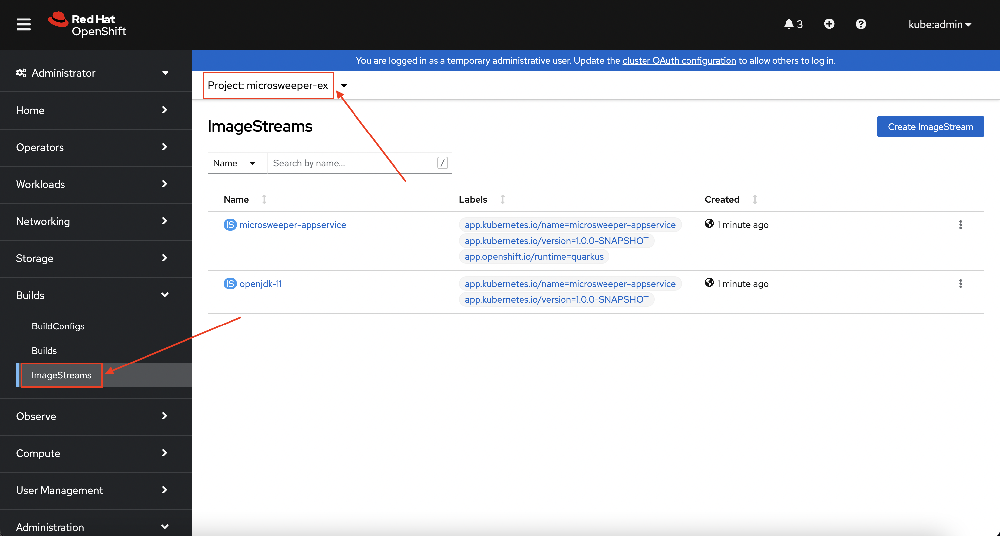
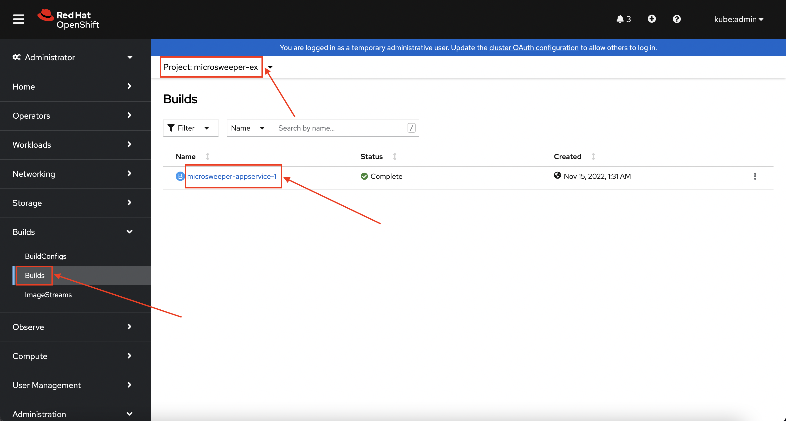
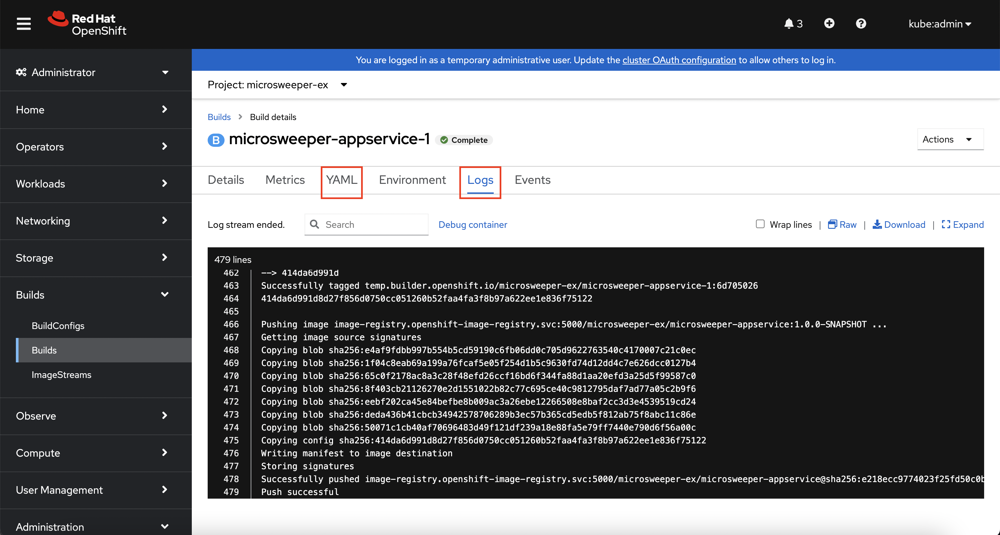
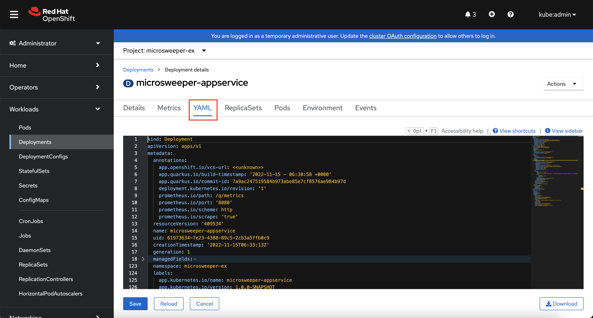
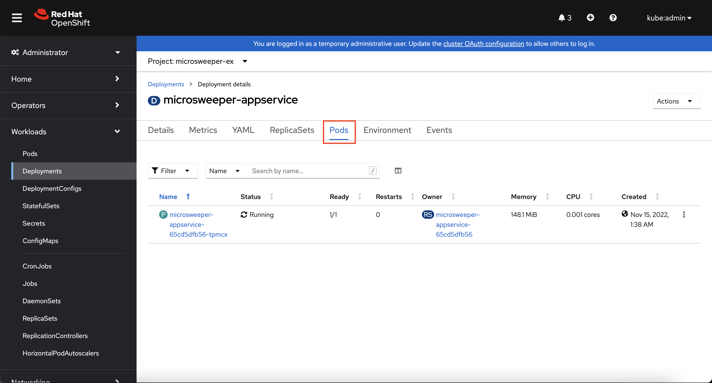

# Introduction

It's time for us to put our cluster to work and deploy a workload. We're going to build an example Java application, [microsweeper](https://github.com/redhat-mw-demos/microsweeper-quarkus/tree/ROSA){:target="_blank"}, using [Quarkus](https://quarkus.io/){:target="_blank"} (a Kubernetes-native Java stack) and [Amazon DynamoDB](https://aws.amazon.com/dynamodb){:target="_blank"}. We'll then deploy the application to our ROSA cluster and connect to the database over AWS's secure network.

## Create an Amazon DynamoDB instance

1. First, let's create a namespace (also known as a project in OpenShift). To do so, run the following command:

    ```bash
    oc new-project microsweeper-ex
    ```

1. Create the Amazon DynamoDB table resource. To do so, run the following command:

    ```bash
    aws dynamodb create-table \
    --table-name ${WS_USER}-microsweeper-scores \
    --attribute-definitions AttributeName=name,AttributeType=S \
    --key-schema AttributeName=name,KeyType=HASH \
    --provisioned-throughput ReadCapacityUnits=1,WriteCapacityUnits=1
    ```

    The output will look something like this:

    ```{.json .no-copy}
    {
        "TableDescription": {
            "AttributeDefinitions": [
                {
                    "AttributeName": "name",
                    "AttributeType": "S"
                }
            ],
            "TableName": "user1_mobbws-microsweeper-scores",
            "KeySchema": [
                {
                    "AttributeName": "name",
                    "KeyType": "HASH"
                }
            ],
            "TableStatus": "CREATING",
            "CreationDateTime": "2023-01-24T22:51:32.131000+00:00",
            "ProvisionedThroughput": {
                "NumberOfDecreasesToday": 0,
                "ReadCapacityUnits": 1,
                "WriteCapacityUnits": 1
            },
            "TableSizeBytes": 0,
            "ItemCount": 0,
            "TableArn": "arn:aws:dynamodb:{{ aws_region }}:395050934327:table/user1_mobbws",
            "TableId": "41160972-56e2-459d-afec-b8a58061cb31"
        }
    }
    ```

## IAM Roles for Service Account (IRSA) Configuration

Our application uses the AWS SDK to make connections to Amazon DynamoDB. While we can use static IAM credentials to do this, this is against AWS' recommended best practices. Instead AWS recommends the use of AWS' Secure Token Service (STS). Lucky for us, we've already deployed our ROSA cluster using AWS STS, so using IAM Roles for Service Accounts (IRSA), also referred to as pod identity, is easy! 

1. First, create a service account to use to assume an IAM role. To do so, run the following command:

    ```bash
    oc -n microsweeper-ex create serviceaccount microsweeper
    ```

1. Next, let's create a trust policy document which will define what service account can assume our role. To create the trust policy document, run the following command:

    ```json
    cat <<EOF > ./trust-policy.json
    {
        "Version": "2012-10-17",
        "Statement": [
            {
                "Effect": "Allow",
                "Principal": {
                    "Federated": "arn:aws:iam::$(aws sts get-caller-identity --query 'Account' --output text):oidc-provider/$(rosa describe cluster -c ${WS_USER/_/-} -o json | jq -r .aws.sts.oidc_endpoint_url | sed -e 's/^https:\/\///')" 
                },
                "Action": "sts:AssumeRoleWithWebIdentity",
                "Condition": {
                    "StringEquals": {
                        "$(rosa describe cluster -c ${WS_USER/_/-} -o json | jq -r .aws.sts.oidc_endpoint_url | sed -e 's/^https:\/\///'):sub": "system:serviceaccount:microsweeper-ex:microsweeper" 
                    }
                }
            }
        ]
    }
    EOF
    ```

1. Next, let's take the trust policy document and use it to create a role. To do so, run the following command:

    ```bash
    aws iam create-role --role-name ${WS_USER}_irsa --assume-role-policy-document file://trust-policy.json --description "${WS_USER} IRSA Role"
    ```

1. Next, let's attach the `AmazonDynamoDBFullAccess` policy to our newly created IAM role. This will allow our application to read and write to our Amazon DynamoDB table. To do so, run the following command:

    ```bash
    aws iam attach-role-policy --role-name ${WS_USER}_irsa --policy-arn=arn:aws:iam::aws:policy/AmazonDynamoDBFullAccess
    ```

1. Finally, let's annotate the service account with the ARN of the IAM role we created above. To do so, run the following command:

    ```bash
    oc -n microsweeper-ex annotate serviceaccount microsweeper eks.amazonaws.com/role-arn=arn:aws:iam::$(aws sts get-caller-identity --query 'Account' --output text):role/${WS_USER}_irsa
    ```

## Build and deploy the Microsweeper app

Now that we've got a DynamoDB instance up and running and our IRSA configuration completed, let's build and deploy our application.

1. First, let's clone the application from GitHub. To do so, run the following command:

    ```bash
    git clone https://github.com/rh-mobb/rosa-workshop-app.git
    ```

1. Next, let's change directory into the newly cloned Git repository. To do so, run the following command:

    ```bash
    cd rosa-workshop-app
    ```

1. Next, we will add the OpenShift extension to the Quarkus CLI. To do so, run the following command:

    ```bash
    quarkus ext add openshift
    ```

1. Now, we'll configure Quarkus to use the DynamoDB instance that we created earlier in this section. To do so, we'll create an `application.properties` file using by running the following command:

    ```xml
    cat <<EOF > ./src/main/resources/application.properties
    # AWS DynamoDB configurations
    %dev.quarkus.dynamodb.endpoint-override=http://localhost:8000
    %prod.quarkus.openshift.env.vars.aws_region=${AWS_DEFAULT_REGION}
    %prod.quarkus.dynamodb.aws.credentials.type=default
    dynamodb.table=${WS_USER}-microsweeper-scores

    # OpenShift configurations
    %prod.quarkus.kubernetes-client.trust-certs=true
    %prod.quarkus.kubernetes.deploy=true
    %prod.quarkus.kubernetes.deployment-target=openshift
    %prod.quarkus.openshift.build-strategy=docker
    %prod.quarkus.openshift.route.expose=true
    %prod.quarkus.openshift.service-account=microsweeper

    # To make Quarkus use Deployment instead of DeploymentConfig
    %prod.quarkus.openshift.deployment-kind=Deployment
    %prod.quarkus.container-image.group=microsweeper-ex
    EOF
    ```

1. Now that we've provided the proper configuration, we will build our application. We'll do this using [source-to-image](https://github.com/openshift/source-to-image){:target="_blank"}, a tool built-in to OpenShift. To start the build and deploy, run the following command:

    ```bash
    quarkus build --no-tests
    ```

## Review

Let's take a look at what this command did, along with everything that was created in your cluster. Return to your tab with the OpenShift Web Console. If you need to reauthenticate, follow the steps in the [Access Your Cluster](../100-setup/3-access-cluster/) section.

### Container Images
From the Administrator perspective, expand *Builds* and then *ImageStreams*, and select the *microsweeper-ex* project.

.

You will see two images that were created on your behalf when you ran the quarkus build command.  There is one image for `openjdk-11` that comes with OpenShift as a Universal Base Image (UBI) that the application will run under. With UBI, you get highly optimized and secure container images that you can build your applications with. For more information on UBI please read this [article](https://www.redhat.com/en/blog/introducing-red-hat-universal-base-image).

The second image you see is the the `microsweeper-appservice` image. This is the image for the application that was built automatically for you and pushed to the built-in container registry inside of OpenShift.

### Image Build

How did those images get built you ask? Back on the OpenShift Web Console, click on *BuildConfigs* and then the *microsweeper-appservice* entry.


When you ran the `quarkus build` command, this created the BuildConfig you can see here. In our quarkus settings, we set the deployment strategy to build the image using Docker. The Dockerfile file from the git repo that we cloned was used for this BuildConfig.

!!! info "A build configuration describes a single build definition and a set of triggers for when a new build is created. Build configurations are defined by a BuildConfig, which is a REST object that can be used in a POST to the API server to create a new instance."

You can read more about BuildConfigs [here](https://docs.openshift.com/container-platform/latest/cicd/builds/understanding-buildconfigs.html)

Once the BuildConfig was created, the source-to-image process kicked off a Build of that BuildConfig. The build is what actually does the work in building and deploying the image.  We started with defining what to be built with the BuildConfig and then actually did the work with the Build.
You can read more about Builds [here](https://docs.openshift.com/container-platform/latest/cicd/builds/understanding-image-builds.html)

To look at what the build actually did, click on Builds tab and then into the first Build in the list.



On the next screen, explore around. Look specifically at the YAML definition of the build and the logs to see what the build actually did. If you build failed for some reason, the logs are a great first place to start to look at to debug what happened.


### Image Deployment
After the image was built, the source-to-image process then deployed the application for us. You can view the deployment under *Workloads* -> *Deployments*, and then click on the Deployment name.


Explore around the deployment screen, check out the different tabs, look at the YAML that was created.


Look at the pod the deployment created, and see that it is running.


The last thing we will look at is the route that was created for our application. In the quarkus properties file, we specified that the application should be exposed to the Internet.  When you create a Route, you have the option to specify a hostname. In this workshop, we will just use the default domain that comes with ROSA (`openshiftapps.com` in our case).

You can read more about routes [in the Red Hat documentation](https://docs.openshift.com/container-platform/latest/networking/routes/route-configuration.html)

From the OpenShift Web Console menu, click on *Networking*->*Routes*, and the *microsweeper-appservice* route.


### Test the application
While in the route section of the OpenShift Web Console, click the URL under *Location*:


You can also get the the URL for your application using the command line:
```bash
oc -n microsweeper-ex get route microsweeper-appservice -o jsonpath='{.spec.host}'
```

### Application IP
Let's take a quick look at what IP the application resolves to. Back in your Cloud Shell environment, run the following command:

```bash
nslookup $(oc -n microsweeper-ex get route microsweeper-appservice -o jsonpath='{.spec.host}')
```

The output of the command will look similar to this:

```{.txt .no-copy}
Server:         168.63.129.16
Address:        168.63.129.16#53

Non-authoritative answer:
Name:   microsweeper-appservice-microsweeper-ex.apps.user1-mobbws.2ep4.p1.openshiftapps.com
Address: 40.117.143.193
```

Notice the IP address; can you guess where it comes from?

It comes from the ROSA Load Balancer. In this workshop, we are using a public cluster which means the load balancer is exposed to the Internet. If this was a private cluster, you would have to have connectivity to the VPC ROSA is running on. This could be via a VPN connection, AWS DirectConnect, or something else.