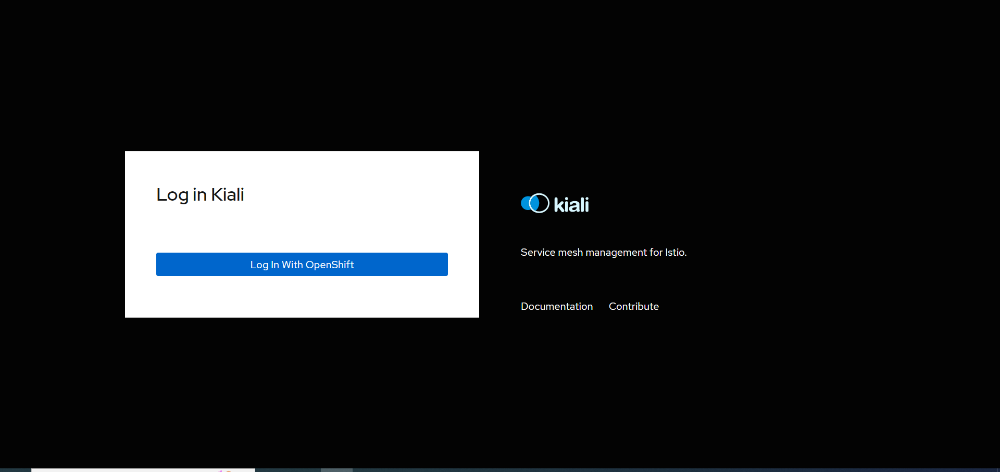
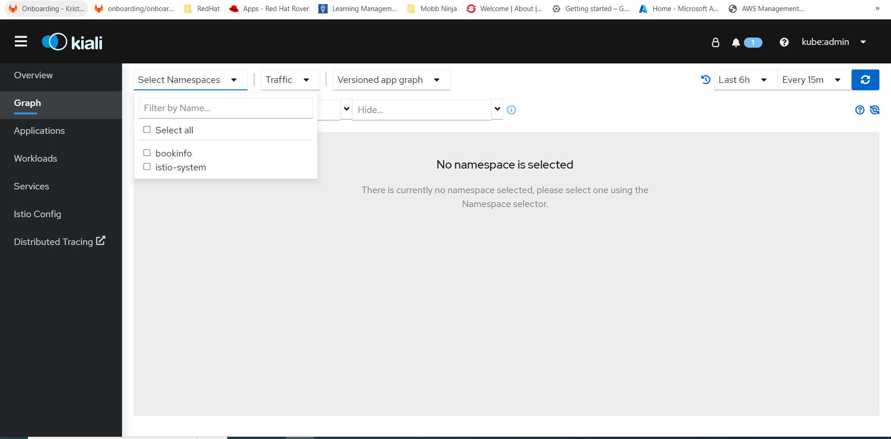
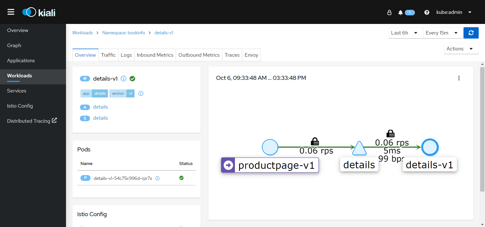

Requests are routed to services within a service mesh with virtual services. Each virtual service consists of a set of routing rules that are evaluated in order. Red Hat OpenShift Service Mesh matches each given request to the virtual service to a specific real destination within the mesh.

Without virtual services, Red Hat OpenShift Service Mesh distributes traffic using round-robin load balancing between all service instances. With a virtual service, you can specify traffic behavior for one or more hostnames. Routing rules in the virtual service tell Red Hat OpenShift Service Mesh how to send the traffic for the virtual service to appropriate destinations. Route destinations can be versions of the same service or entirely different services.

### Configuring virtual services with weighted load balancing

1. Weighted load balancing requests are forwarded to instances in the pool according to a specific percentage. In this example 80% to v1, 20% to v2. To create a virtual service with this configuration, run the following command:

    ```yaml
    cat << EOF | oc apply -f -
    apiVersion: networking.istio.io/v1alpha3
    kind: VirtualService
    metadata:
      name: reviews
    spec:
      hosts:
        - reviews
      http:
      - route:
        - destination:
            host: reviews
            subset: v1
          weight: 80
        - destination:
            host: reviews
            subset: v2
          weight: 20
    EOF
    ```

1. Refresh your browser tab containing the Bookinfo URL a few times and you'll see that occasionally you'll see the v2 of the book review app which has star ratings. 

    Accidentally close out of the tab? No problem, run the following command to get the product page URL:
    
    ```bash
    echo "http://$(oc -n istio-system get route istio-ingressgateway -o jsonpath='{.spec.host}')/productpage"
    ```

### Observe traffic using the Kiali web console

Kiali is an observability console for the OpenShift Service Mesh with service mesh configuration and validation capabilities. It helps you understand the structure and health of your service mesh by monitoring traffic flow to infer the topology and report errors.

1. First, grab the Kiali web console URL. To do so, run the following command: 

    ```bash
    echo "https://$(oc get routes -n istio-system kiali -o jsonpath='{.spec.host}')/console"
    ```

1. Next, navigate to that URL in your web browser and click the `Login With OpenShift` button.

    

    Once logged in, the Kiali Overview screen presents tiles for each project namespace.

    
    

1. Now, let's generate some traffic against the product page service. To do so, run the following command in your terminal:

    ```bash
    while true; do curl -sSL "http://$(oc -n istio-system get route istio-ingressgateway -o jsonpath='{.spec.host}')/productpage" | head -n 5; sleep 1; done
    ```
    
    Leave the loop running and proceed to the next steps.

1. Return to the Kiali web console and click the *Graph* option in the sidebar.

1. Next, select *bookinfo* from the Namespace list, and App graph from the Graph Type list.

    

1. Next, click on the *Display idle nodes* button.

    

1. Next, view the graph and change the display settings to add or remove information from the graph.
    
    

1. Next, click the *Workload* tab and select the *details-v1* workload. 
    
    

    Congratulations! You should now see traffic flowing between the various services in your bookinfo application. 